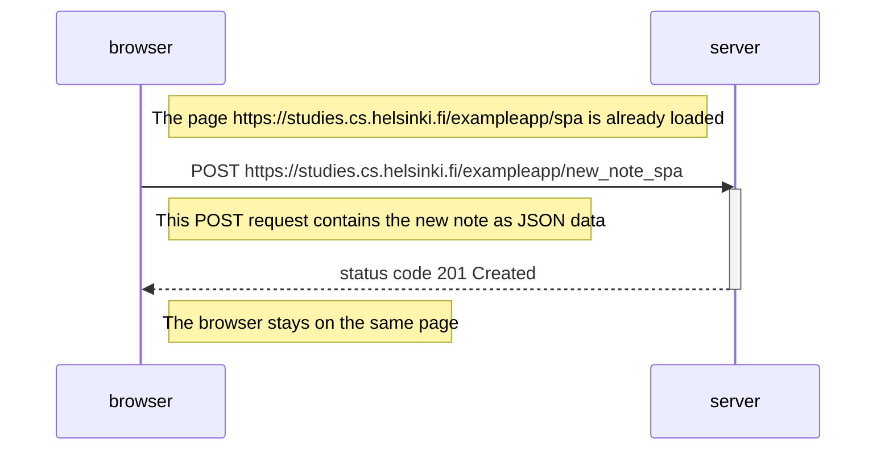

```mermaid
sequenceDiagram
    participant browser
    participant server

    Note right of browser: The page https://studies.cs.helsinki.fi/exampleapp/spa is already loaded

    browser->>server: POST https://studies.cs.helsinki.fi/exampleapp/new_note_spa
    activate server
    Note right of browser: This POST request contains the new note as JSON data
    server-->>browser: status code 201 Created
    deactivate server

    Note right of browser: The browser stays on the same page
```